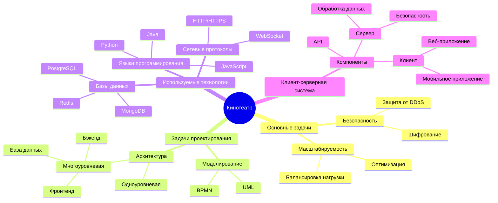
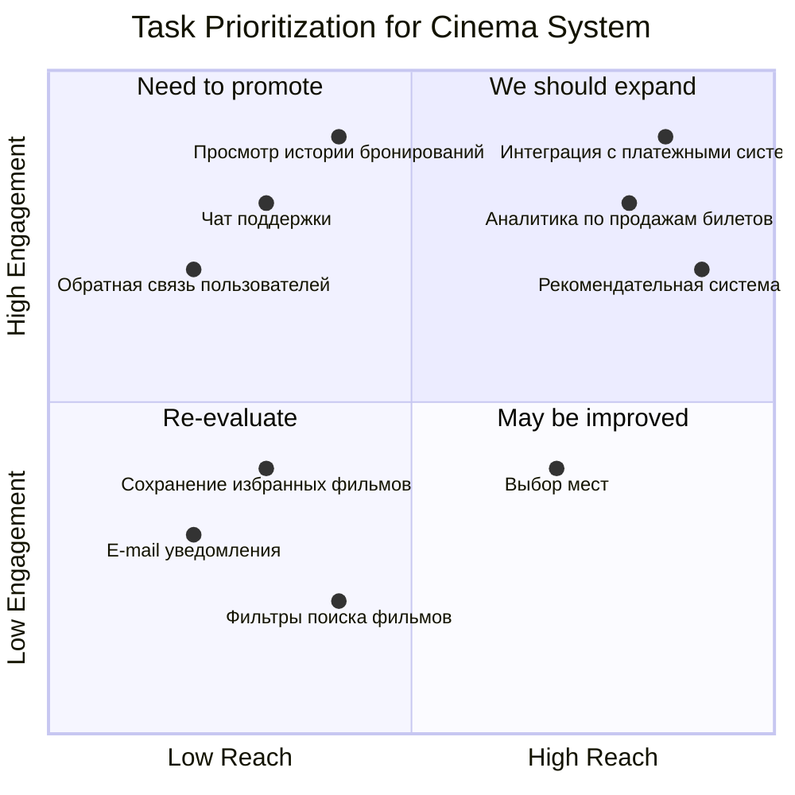
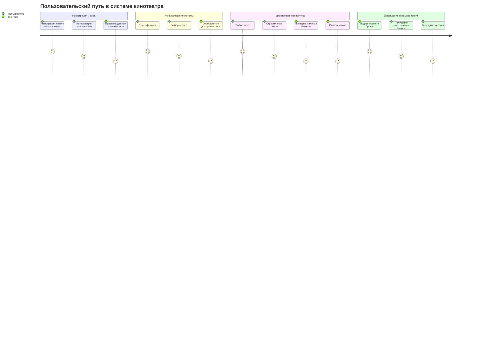

```mermaid
mindmap
  root((Кинотеатр))
    Основные задачи
      Масштабируемость
        Балансировка нагрузки
        Оптимизация
      Безопасность
        Шифрование
        Защита от DDoS
    Задачи проектирования
      Моделирование
        UML
        BPMN
      Архитектура
        Одноуровневая
        Многоуровневая
          Фронтенд
          Бэкенд
          База данных
    Используемые технологии
      Базы данных
        PostgreSQL
        MongoDB
        Redis
      Языки программирования
        Python
        JavaScript
        Java
      Сетевые протоколы
        WebSocket
        HTTP/HTTPS
    Клиент-серверная система
      Компоненты
        API
        Сервер
          Обработка данных
          Безопасность
        Клиент
          Мобильное приложение
          Веб-приложение
```

```memraid
gitGraph
    commit
    commit
    branch develop
    checkout develop
    commit
    commit
    checkout main
    merge develop
    commit
    commit
```


```mermaid
quadrantChart
    title Task Prioritization for Cinema System
     x-axis Low Reach --> High Reach
    y-axis Low Engagement --> High Engagement
    quadrant-1 We should expand
    quadrant-2 Need to promote
    quadrant-3 Re-evaluate
    quadrant-4 May be improved
    "Чат поддержки": [0.3, 0.8]
    "Обратная связь пользователей": [0.2, 0.7]
    "Просмотр истории бронирований": [0.4, 0.9]
    "Аналитика по продажам билетов": [0.8, 0.8]
    "Интеграция с платежными системами": [0.85, 0.9]
    "Рекомендательная система фильмов": [0.9, 0.7]
    "E-mail уведомления": [0.2, 0.3]
    "Сохранение избранных фильмов": [0.3, 0.4]
    "Фильтры поиска фильмов": [0.4, 0.2]
    "Выбор мест": [0.7, 0.4]
```


```mermaid
journey
    title Пользовательский путь в системе кинотеатра
    section Регистрация и вход
      Регистрация нового пользователя: 5: Пользователь
      Авторизация пользователя: 4: Пользователь
      Проверка данных пользователя: 3: Система
    section Использование системы
      Поиск фильма: 5: Пользователь
      Выбор сеанса: 4: Пользователь
      Отображение доступных мест: 3: Система
    section Бронирование и покупка
      Выбор мест: 5: Пользователь
      Оформление заказа: 4: Пользователь
      Проверка наличия билетов: 3: Система
      Оплата заказа: 3: Система
    section Завершение взаимодействия
      Подтверждение брони: 5: Система
      Получение электронного билета: 4: Пользователь
      Выход из системы: 3: Пользователь
```